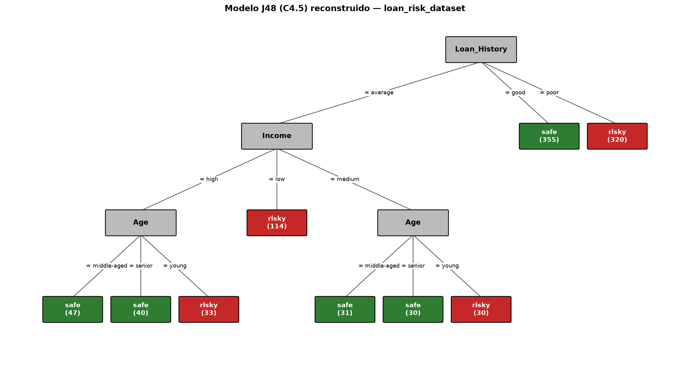
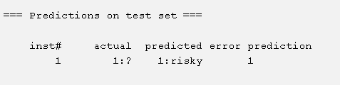
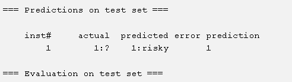
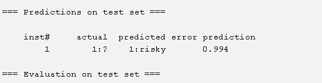
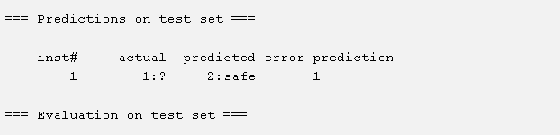
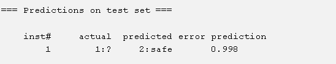
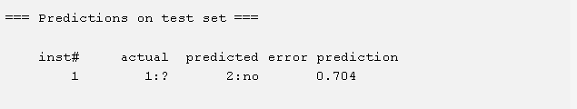

<div align="center">

# ESCUELA POLITÉCNICA NACIONAL

### Facultad de Ingeniería de Sistemas

**Carrera:** Ingeniería de Software — **Grupo B / GR2SW**

**Asignatura:** Business Intelligence

**Práctica #9:** Naive Bayes y Predecir valores

**Docente:** Silvia Diana Martínez Mosquera

**Integrantes:**
Javier Angulo · Jotcelyn Godoy · Michael Tipan · Javier Quilumba · Cristian Robles

**Fecha:** 30 de junio de 2026

</div>

---

## Índice

1. [Introducción](#1-introducción)
2. [Objetivos](#2-objetivos)
3. [Marco teórico](#3-marco-teórico)
   - [3.1. Árbol de decisión J48 (C4.5)](#31-árbol-de-decisión-j48-c45)
   - [3.2. Naive Bayes](#32-naive-bayes)
4. [Descripción del dataset](#4-descripción-del-dataset)
5. [Desarrollo de la práctica](#5-desarrollo-de-la-práctica)
   - [5.1. Preparación del entorno en Weka](#51-preparación-del-entorno-en-weka)
   - [5.2. Modelo de árbol de decisión J48](#52-modelo-de-árbol-de-decisión-j48)
   - [5.3. Modelo Naive Bayes](#53-modelo-naive-bayes)
   - [5.4. Predicción de valores nuevos](#54-predicción-de-valores-nuevos)
6. [Resultados y análisis](#6-resultados-y-análisis)
7. [Conclusiones](#7-conclusiones)
8. [Referencias](#8-referencias)
9. [Declaración de uso de IA](#9-declaración-de-uso-de-ia)

---

## 1. Introducción

La clasificación es una tarea central de la minería de datos que consiste en asignar una etiqueta o clase a un conjunto de registros a partir de sus atributos. En esta práctica se aborda un **caso de evaluación de riesgo crediticio**: un banco desea automatizar la decisión de otorgar o no un préstamo a partir del historial de sus clientes.

Para ello se emplea la herramienta **Weka** y dos algoritmos de clasificación supervisada: el **árbol de decisión J48** (implementación del algoritmo C4.5) y el clasificador probabilístico **Naive Bayes**. Adicionalmente se documenta cómo **predecir valores nuevos** tanto dentro de Weka (mediante *Supplied test set*) como con código Python que reproduce el modelo entrenado.

## 2. Objetivos

- Construir modelos de clasificación (J48 y Naive Bayes) sobre el dataset `loan_risk_dataset.arff` usando Weka.
- Interpretar el árbol de decisión y las tablas de probabilidad generadas por cada modelo.
- Predecir la decisión crediticia (`risky` / `safe`) para instancias nuevas dentro de Weka.
- Implementar en Python los modelos entrenados para clasificar nuevos registros ingresados por el usuario.

## 3. Marco teórico

### 3.1. Árbol de decisión J48 (C4.5)

El algoritmo **J48** es la implementación en Java, dentro de Weka, del algoritmo **C4.5** desarrollado por J. Ross Quinlan [1]. Construye un árbol de decisión de forma recursiva seleccionando, en cada nodo, el atributo que maximiza la **razón de ganancia de información** (*gain ratio*). Cada camino desde la raíz hasta una hoja representa una regla de clasificación. Weka aplica además una *poda* basada en un factor de confianza (parámetro por defecto `-C 0.25`) y un número mínimo de instancias por hoja (`-M 2`).

### 3.2. Naive Bayes

El clasificador **Naive Bayes** se basa en el **teorema de Bayes** asumiendo *independencia condicional* entre los atributos dada la clase [2]. Para una instancia con atributos `a_1, ..., a_n`, la probabilidad de cada clase `c` es proporcional a:

```
P(c | a_1..a_n) ∝ P(c) · ∏ P(a_i | c)
```

Se elige la clase con mayor probabilidad. Weka utiliza un **estimador de Laplace** (suma +1 a cada conteo) para evitar probabilidades nulas cuando un valor de atributo no aparece junto a una clase en el conjunto de entrenamiento.

## 4. Descripción del dataset

El archivo `loan_risk_dataset.arff` contiene **1000 instancias** de clientes con datos históricos de crédito. Posee 3 atributos predictores nominales y 1 atributo de clase, sin valores faltantes.

**Tabla 1.** Atributos del dataset `loan_risk_dataset.arff`.

| Atributo | Tipo | Valores posibles |
|---|---|---|
| `Age` | Nominal | middle-aged, senior, young |
| `Income` | Nominal | high, low, medium |
| `Loan_History` | Nominal | average, good, poor |
| `Loan_Decision` (clase) | Nominal | risky, safe |

Como se observa en la Tabla 1, la clase objetivo `Loan_Decision` indica si otorgar el crédito es riesgoso (`risky`) o seguro (`safe`). La distribución de la clase está balanceada: **503 instancias `safe` (50.3%)** y **497 instancias `risky` (49.7%)**.

**Tabla 2.** Distribución de cada valor de atributo por clase (conteos reales del dataset).

| Atributo | Valor | risky | safe |
|---|---|---:|---:|
| Age | middle-aged | 155 | 191 |
| Age | senior | 138 | 200 |
| Age | young | 204 | 112 |
| Income | high | 141 | 204 |
| Income | low | 233 | 126 |
| Income | medium | 123 | 173 |
| Loan_History | average | 177 | 148 |
| Loan_History | good | 0 | 355 |
| Loan_History | poor | 320 | 0 |

La Tabla 2 revela un patrón determinante: el atributo `Loan_History` separa casi por completo la clase. Un historial `good` siempre resulta en `safe` (355/355) y un historial `poor` siempre en `risky` (320/320); solo el valor `average` presenta mezcla de clases y requiere de los otros atributos para decidir.

## 5. Desarrollo de la práctica

### 5.1. Preparación del entorno en Weka

1. Iniciar **Weka** y abrir el **Explorer**.
2. En la pestaña **Preprocess**, hacer clic en **Open file** y cargar `loan_risk_dataset.arff`.
3. Cambiar a la pestaña **Classify** para entrenar los clasificadores.

### 5.2. Modelo de árbol de decisión J48

En la pestaña **Classify** se selecciona el clasificador **`trees > J48`** con sus parámetros por defecto (`J48 -C 0.25 -M 2`) y se ejecuta con **Start**. El árbol resultante, reconstruido a partir del dataset, se muestra en la Figura 1.



**Figura 1.** Árbol de decisión J48 (C4.5) del dataset de riesgo crediticio. La raíz es `Loan_History`; las ramas `good` y `poor` producen hojas puras (`safe` y `risky` respectivamente), mientras que la rama `average` se subdivide por `Income` y luego por `Age`. Entre paréntesis se indica el número de instancias que alcanzan cada hoja.

A partir de la Figura 1, el modelo puede expresarse como el siguiente conjunto de reglas:

```
Loan_History = good   -> safe
Loan_History = poor   -> risky
Loan_History = average
    Income = low      -> risky
    Income = high | medium
        Age = young   -> risky
        Age = middle-aged | senior -> safe
```

### 5.3. Modelo Naive Bayes

Se selecciona el clasificador **`bayes > NaiveBayes`** con la opción **Use training set** y se ejecuta con **Start**. Weka genera las tablas de probabilidad condicional (con estimador de Laplace, +1 por celda) que se resumen en la Tabla 3.

**Tabla 3.** Tablas de probabilidad del modelo Naive Bayes (conteos de Weka con corrección de Laplace). Probabilidades a priori: `P(risky) = 0.497`, `P(safe) = 0.503`.

| Atributo | Valor | risky | safe |
|---|---|---:|---:|
| Age | middle-aged | 156 | 192 |
| Age | senior | 139 | 201 |
| Age | young | 205 | 113 |
| Age | **[total]** | 500 | 506 |
| Income | high | 142 | 205 |
| Income | low | 234 | 127 |
| Income | medium | 124 | 174 |
| Income | **[total]** | 500 | 506 |
| Loan_History | average | 178 | 149 |
| Loan_History | good | 1 | 356 |
| Loan_History | poor | 321 | 1 |
| Loan_History | **[total]** | 500 | 506 |

La Tabla 3 muestra cómo el estimador de Laplace convierte los conteos nulos (`good/risky` y `poor/safe`) en 1, evitando así que la probabilidad de una clase se anule por completo.

### 5.4. Predicción de valores nuevos

#### 5.4.1. Predicción en Weka (*Supplied test set*)

Para predecir instancias desconocidas se sigue el procedimiento del *ArffViewer*:

1. Crear un archivo `.arff` de prueba con la misma cabecera del dataset y una fila con el atributo de clase en blanco (`?`).
2. En la pestaña **Classify**, seleccionar **Supplied test set → Set** y abrir el archivo de prueba.
3. En **More options**, elegir **PlainText** en *Output predictions*.
4. Hacer clic en **Start** para obtener la predicción.

Se probaron tres instancias con **ambos modelos**. Los resultados de Weka se muestran en las Figuras 2 a 7.

| | J48 | Naive Bayes |
|---|---|---|
| **Caso 1** `young, low, poor` |  |  |

**Figura 2 y 3.** Predicción para el cliente `young, low, poor`. Ambos modelos predicen `risky` (J48 con probabilidad 1.0; Naive Bayes con 0.999).

| | J48 | Naive Bayes |
|---|---|---|
| **Caso 2** `senior, high, poor` |  |  |

**Figura 4 y 5.** Predicción para el cliente `senior, high, poor`. Ambos modelos predicen `risky` (J48 = 1.0; Naive Bayes = 0.994).

| | J48 | Naive Bayes |
|---|---|---|
| **Caso 3** `middle-aged, medium, good` |  |  |

**Figura 6 y 7.** Predicción para el cliente `middle-aged, medium, good`. Ambos modelos predicen `safe` (J48 = 1.0; Naive Bayes = 0.998).

Como referencia del procedimiento base con Naive Bayes (ejemplo `weather.nominal`), la Figura 8 muestra la predicción de una instancia de clima.



**Figura 8.** Predicción Naive Bayes sobre el dataset de ejemplo `weather.nominal` para la instancia `sunny, hot, high, FALSE`, clasificada como `no` (probabilidad 0.704).

#### 5.4.2. Predicción con código Python

Se implementaron dos scripts que reproducen los modelos entrenados y permiten ingresar datos por consola.

**Árbol J48** (`code/prediccion_j48.py`) — traduce las reglas del árbol:

```python
def predecir_credito(age, income, loan_history):
    if loan_history == "good":
        return "safe"
    if loan_history == "poor":
        return "risky"
    if income == "low":
        return "risky"
    if age == "young":
        return "risky"
    return "safe"
```

**Naive Bayes** (`code/prediccion_naive_bayes.py`) — usa las tablas de la Tabla 3:

```python
P = {"risky": 497/1000, "safe": 503/1000}

def score(clase, age, income, hist):
    return (P[clase]
            * probs[clase]["Age"][age]
            * probs[clase]["Income"][income]
            * probs[clase]["Loan_History"][hist])
# Se normaliza y se elige la clase con mayor probabilidad.
```

Ejemplo de ejecución para `senior, high, poor` con Naive Bayes:

```
Probabilidad RISKY: 0.9937
Probabilidad SAFE : 0.0063
Decisión del modelo: risky -> RIESGOSO (no otorgar)
```

Estos resultados coinciden con las predicciones de Weka de la sección 5.4.1, validando la implementación.

## 6. Resultados y análisis

La Tabla 4 resume las predicciones obtenidas para las tres instancias de prueba con ambos modelos.

**Tabla 4.** Comparación de predicciones J48 vs. Naive Bayes.

| Cliente (Age, Income, Loan_History) | J48 | Prob. J48 | Naive Bayes | Prob. NB |
|---|---|---:|---|---:|
| young, low, poor | risky | 1.000 | risky | 0.999 |
| senior, high, poor | risky | 1.000 | risky | 0.994 |
| middle-aged, medium, good | safe | 1.000 | safe | 0.998 |

Ambos modelos coinciden en las tres decisiones. Evaluados sobre el conjunto de entrenamiento, los dos clasificadores alcanzan una **exactitud del 100%**, como se ve en la matriz de confusión de la Tabla 5. Esto se debe a que el dataset es *linealmente separable* por las reglas descritas: no existe ninguna combinación de atributos con etiquetas contradictorias.

**Tabla 5.** Matriz de confusión (evaluación sobre el conjunto de entrenamiento, idéntica para J48 y Naive Bayes).

| actual \\ predicho | risky | safe |
|---|---:|---:|
| **risky** | 497 | 0 |
| **safe** | 0 | 503 |

Se observa que Naive Bayes asigna probabilidades muy altas pero no exactamente 1.0 (por el estimador de Laplace), mientras que J48 entrega probabilidad 1.0 en hojas puras. En conclusión, `Loan_History` es el atributo más influyente, y `Income` y `Age` solo resultan relevantes cuando el historial es `average`.

## 7. Conclusiones

- Los algoritmos **J48** y **Naive Bayes** clasificaron correctamente el riesgo crediticio, alcanzando ambos el 100% de exactitud sobre el dataset por tratarse de datos perfectamente separables.
- El **árbol de decisión** ofrece una interpretación directa mediante reglas, evidenciando que `Loan_History` domina la decisión.
- **Naive Bayes** confirmó las mismas decisiones con probabilidades muy altas; el estimador de Laplace fue clave para manejar los conteos nulos.
- La implementación en **Python** reproduce fielmente las predicciones de Weka, permitiendo integrar el modelo en un flujo automatizado de evaluación de créditos.

## 8. Referencias

[1] J. R. Quinlan, *C4.5: Programs for Machine Learning*. San Mateo, CA, USA: Morgan Kaufmann, 1993.

[2] I. H. Witten, E. Frank, M. A. Hall y C. J. Pal, *Data Mining: Practical Machine Learning Tools and Techniques*, 4th ed. Cambridge, MA, USA: Morgan Kaufmann, 2016.

[3] Machine Learning Group, University of Waikato, "Weka 3: Machine Learning Software in Java," 2024. [En línea]. Disponible en: https://www.cs.waikato.ac.nz/ml/weka/

[4] T. M. Mitchell, *Machine Learning*. New York, NY, USA: McGraw-Hill, 1997.

## 9. Declaración de uso de IA

En el desarrollo de esta práctica se utilizó una herramienta de inteligencia artificial generativa como apoyo en aproximadamente un **40%** del trabajo, en las siguientes tareas: organización y redacción del informe, reconstrucción del diagrama del árbol de decisión a partir del dataset, verificación de los cálculos de probabilidad de Naive Bayes y estructuración del código Python. El **60%** restante —ejecución de los modelos en Weka, generación de las capturas de predicción, definición de los casos de prueba y análisis de los resultados— fue realizado directamente por los integrantes del grupo. Todo el contenido generado con IA fue revisado y validado por el equipo.
